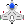

<!DOCTYPE html>
<html lang="en">
<head>
  <meta charset="UTF-8" />
  <title>Combined Anticipation & ADHD/Delay Aversion Games</title>
  
  
</head>
<body>
  

    <h2 style="color: #ffe066; text-align: center; margin-top: 0;">ADHD/Delay Aversion Game Results Analysis</h2>
    
    

      <h3 style="color: #4fc3f7;">Section 1: Window Choice Profile (Impulsivity & Delay Aversion)</h3>
      

        <h4>Mean Window Chosen</h4>
        
<strong>What it Measures:</strong> Average window number the player shoots from (1-3). Lower numbers indicate preference for immediate rewards.

        
<strong>ADHD Indicator (≤ 2.0):</strong> Suggests difficulty waiting for delayed rewards.

        
<strong>Real-World Meaning:</strong> Child may struggle with waiting their turn or delay gratification.

      

      
      

        <h4>Window 1 Rate</h4>
        
<strong>What it Measures:</strong> Percentage of trials where the player chose the first (immediate) window.

        
<strong>ADHD Indicator (≥ 40%):</strong> Suggests significant impulsivity.

        
<strong>Real-World Meaning:</strong> Difficulty waiting even short periods for better outcomes.

      

      
      

        <h4>Window 3 Persistence</h4>
        
<strong>What it Measures:</strong> How often the player continues aiming for Window 3 after a failure.

        
<strong>ADHD Indicator (≤ 50%):</strong> Suggests low frustration tolerance.

        
<strong>Real-World Meaning:</strong> Tends to give up on challenging tasks after setbacks.

      

    

    
    

      <h3 style="color: #4fc3f7;">Section 2: Asteroid Task Performance (Attention & Impulse Control)</h3>
      

        <h4>Blue Error Rate</h4>
        
<strong>What it Measures:</strong> Percentage of blue (penalty) asteroids that were clicked.

        
<strong>ADHD Indicator (≥ 35%):</strong> Indicates poor response inhibition.

        
<strong>Real-World Meaning:</strong> Child acts without thinking, making careless mistakes.

      

      
      

        <h4>Omission Rate</h4>
        
<strong>What it Measures:</strong> Percentage of all asteroids that were not clicked.

        
<strong>ADHD Indicator (≥ 30%):</strong> Indicates inattention and mind-wandering.

        
<strong>Real-World Meaning:</strong> Child frequently misses instructions or details.

      

      
      

        <h4>Red Capture Rate</h4>
        
<strong>What it Measures:</strong> Percentage of red (reward) asteroids successfully clicked.

        
<strong>ADHD Indicator (≤ 65%):</strong> Indicates poor sustained attention.

        
<strong>Real-World Meaning:</strong> Difficulty maintaining focus on tasks over time.

      

    

    
    

      <h3 style="color: #4fc3f7;">Section 3: Reaction Time Profile (Cognitive Consistency)</h3>
      

        <h4>RT Standard Deviation</h4>
        
<strong>What it Measures:</strong> Variability in reaction times.

        
<strong>ADHD Indicator (≥ 130ms):</strong> Inconsistent attention state.

        
<strong>Real-World Meaning:</strong> Unpredictable performance from moment to moment.

      

      
      

        <h4>Late Window Entries</h4>
        
<strong>What it Measures:</strong> How often player misses optimal timing.

        
<strong>ADHD Indicator (≥ 25%):</strong> Poor timing and planning.

        
<strong>Real-World Meaning:</strong> Frequently misses deadlines or is late.

      

      
      

        <h4>RT Skewness</h4>
        
<strong>What it Measures:</strong> Pattern of reaction time distribution.

        
<strong>ADHD Indicator (Positive Skew):</strong> Mix of fast and very slow responses.

        
<strong>Real-World Meaning:</strong> Attention periodically "shuts off" during tasks.

      

    

    
    

      <h3 style="color: #4fc3f7;">Overall Interpretation</h3>
      
<strong>15/22 or higher:</strong> Strong indication of ADHD-related traits

      
<strong>11-14/22:</strong> Moderate indication

      
      <h4>Profile Patterns:</h4>
      <ul>
        <li>High Scores in Section 1 & 4: Impulsive/Hyperactive profile</li>
        <li>High Scores in Section 2 & 4: Inattentive profile</li>
        <li>High Scores across all sections: Combined profile</li>
      </ul>
    

  

  

    

    

    

    

    
    <!-- Game Explanation Modal -->
    

      <h2>Game Instructions</h2>
      
      

        <h3>1. Anticipation Game</h3>
        
Test your timing and anticipation skills in this reaction-based game:

        <ul>
          <li>Watch for an orange ball that appears at random positions on the screen</li>
          <li>Press the <strong>SPACEBAR</strong> as quickly as possible when you see the ball</li>
          <li>Some trials will have an <strong>invisible dot</strong> instead - press SPACEBAR when you think it should appear</li>
          <li>The game has three blocks with different timing patterns (500ms, 1000ms, and 2000ms)</li>
          <li>Your reaction time and accuracy will be measured for both visible and invisible trials</li>
        </ul>
        

          <strong>Pro Tip:</strong> Try to learn the timing pattern in each block. The better you anticipate when the stimulus will appear, the faster your reaction time will be!
        

      

      

        <h3>2. ADHD / Delay Aversion Game</h3>
        
Test your impulse control and decision-making under time pressure:

        <ul>
          <li>Control a spaceship that moves automatically from left to right</li>
          <li>Three reward windows will appear with different point values (1, 2, or 3 points)</li>
          <li>Press <strong>SPACEBAR</strong> when your ship is aligned with a window to collect points</li>
          <li>Click on red asteroids for +1 point, but avoid blue asteroids (-1 point)</li>
          <li>Watch out! The alien ship might block your reward sometimes</li>
        </ul>
        

          <strong>Strategy:</strong> The further right you go, the higher the potential reward, but the risk of missing increases. Find the right balance between risk and reward!
        

      

      <button id="startGamesBtn">I'm Ready to Play!</button>
    

    

      <h2 id="spriteTitle">Game Sprites & What They Do</h2>
      
Anticipation Game

      

        

          

        

        
<strong>Ball</strong> Visible orange circle. Press SPACE when you see it to record a reaction time.

      

      

        

          

        

        
<strong>Invisible Dot</strong> Small invisible marker that appears instead of the ball on some trials. Press SPACE when it appears (even if you don't see it).

      

      
ADHD / Delay Aversion Game

      

        

          
        

        
<strong>Player Ship</strong> The ship you control. Move into a window and press SPACE to attempt to get the reward behind that window.

      

      

        

          
        

        
<strong>Asteroids</strong> Red asteroids are targets that give +1 if clicked. Blue asteroids are penalties (-1) if clicked. Clicking asteroids is optional but affects attention/impulsivity scoring.

      

      

        <button class="startBtn" id="spriteStartBtn">Start First Game</button>
      

    

    
    <button id="startBtn">Start First Game</button>
    <button id="nextGameBtn">Next Game</button>
    <button id="downloadBtn">Download Results (.xlsx)</button>
    

    

    <form id="participantForm">
      <label for="nameInput">Your Name:</label>
      <input id="nameInput" name="name" type="text" maxlength="32" required>
      <label for="ageInput">Your Age:</label>
      <input id="ageInput" name="age" type="number" min="6" max="99" required>
      <label for="genderInput">Your Gender:</label>
      <select id="genderInput" name="gender" required>
        <option value="" disabled selected>Select</option>
        <option value="male">Male</option>
        <option value="female">Female</option>
      </select>
      <button id="formBtn" type="submit">Start the Games!</button>
    </form>
  

  
  <canvas id="gameCanvas"></canvas>
  <button id="excelBtn">Download Excel Output (XLSX)</button>
  <pre id="summaryBox"></pre>
  
  <!-- Audio elements for game feedback -->
  <audio id="successSound" preload="auto">
    <source src="success.ogg" type="audio/ogg">
    <source src="success.mp3" type="audio/mpeg">
    Your browser does not support the audio element.
  </audio>
  <audio id="loseSound" preload="auto">
    <source src="lose.wav" type="audio/wav">
    <source src="lose.mp3" type="audio/mpeg">
    Your browser does not support the audio element.
  </audio>

  
</body>
</html>

